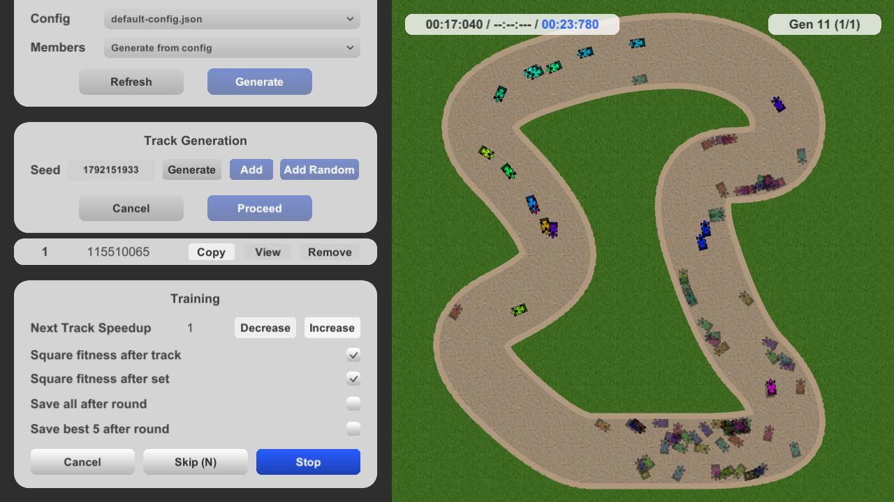

# Car Brains

Car brains is a toy game where you train cars to drive around a track using neural networks and genetic algorithms. Right now, it only works on Windows. It's not very useful, but can be pretty fun to watch.

<p align="center">
  
</p>

## Playing

When you first start it, the game creates a configuration file under

```
C:\Users\{YourName}\Documents\CarBrains\config\default-config.json
```

Copy that file and edit it to your delight. The config contains settings controlling how the neural networks are constructed and how the genetic algorithm operates. *Please do not edit the default config, as any changes will get lost after the game is restarted.*

Once you are satisfied with your config, click *Refresh* and generate a population of cars from it. Next create some track for them to drive around, and then proceed to the training window. There, you can watch your cars fail to finish a simple track for countless hours.

## Technology

The neural networks and genetic algorithm are written in Rust and reside in the `brains` folder. After compiling, move the DLL into `game/Assets/Plugins` to make it available in Unity. This requires a restart of the engine.

The Rust code interacts with the Unity frontend via a manually written C API. Because I am too lazy to replicate structs from Rust in C#, I use JSON files to pass around information wherever performance is of no concern.